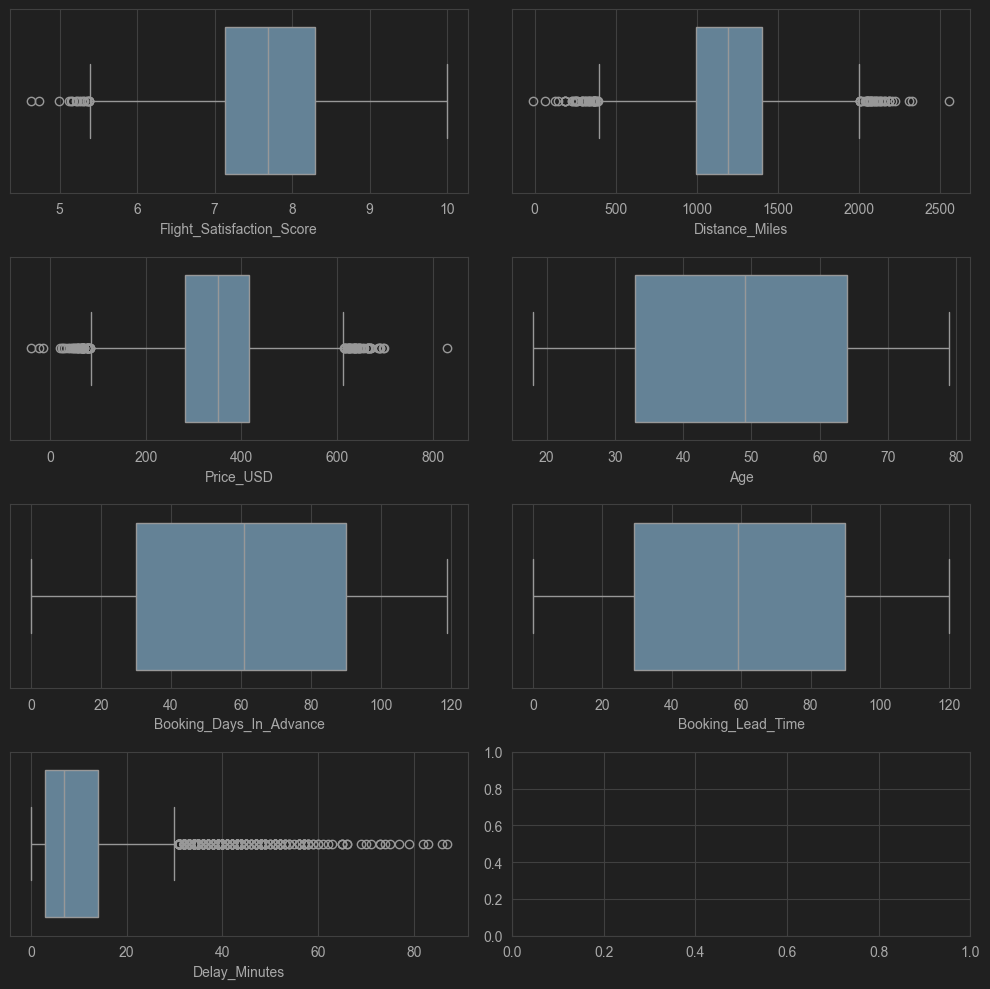
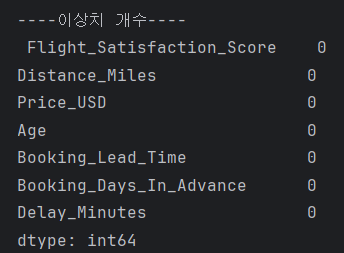
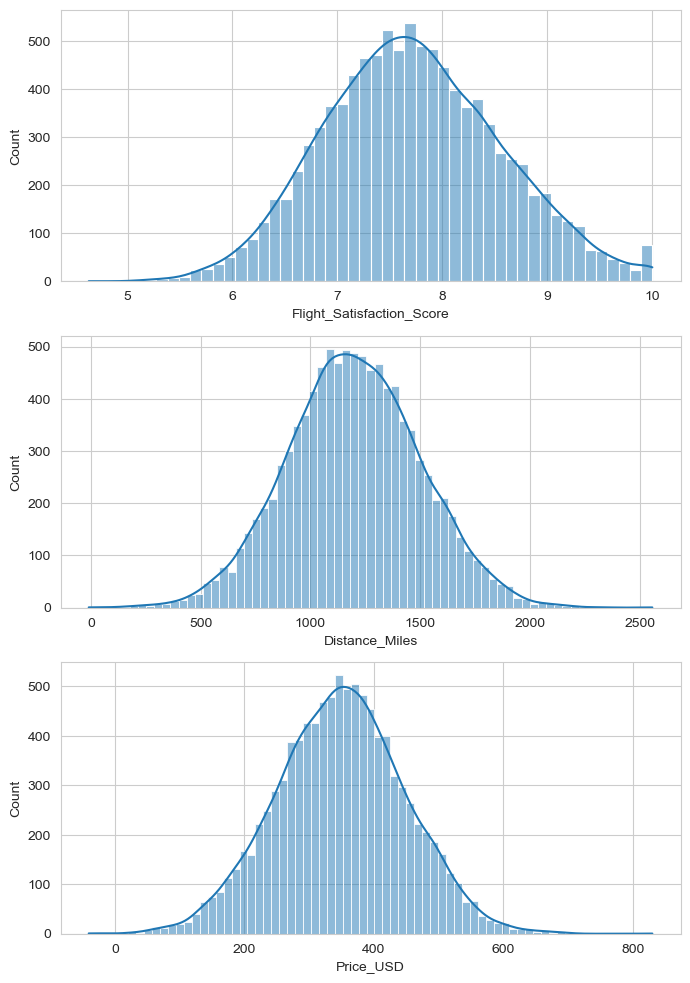
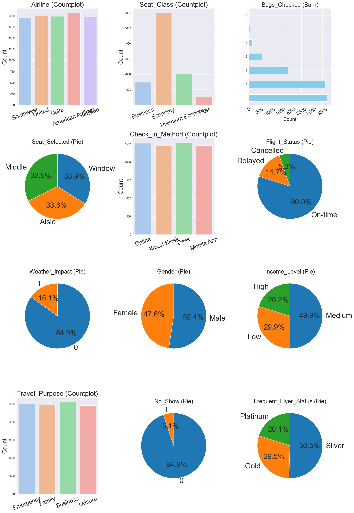
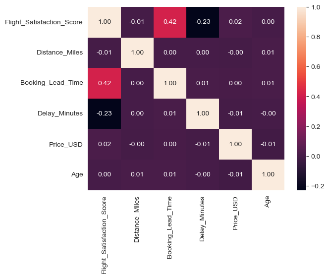
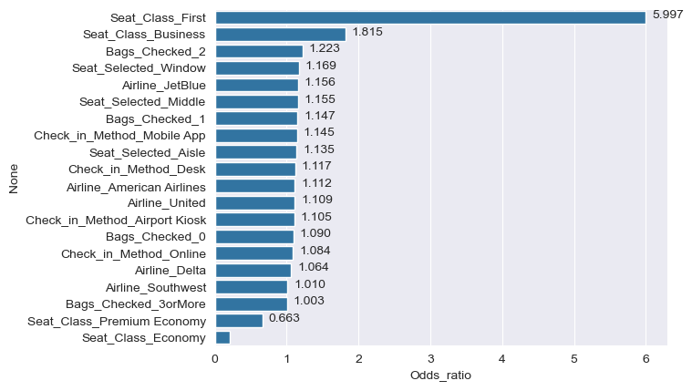
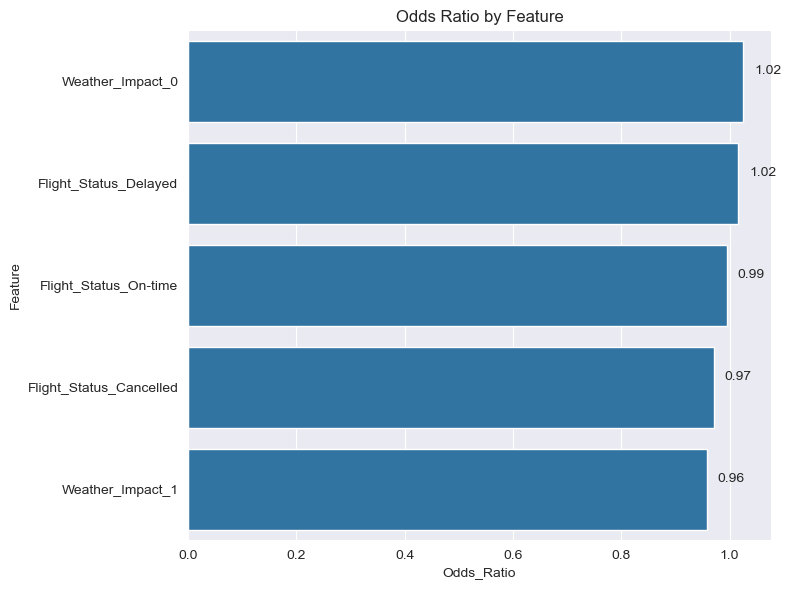
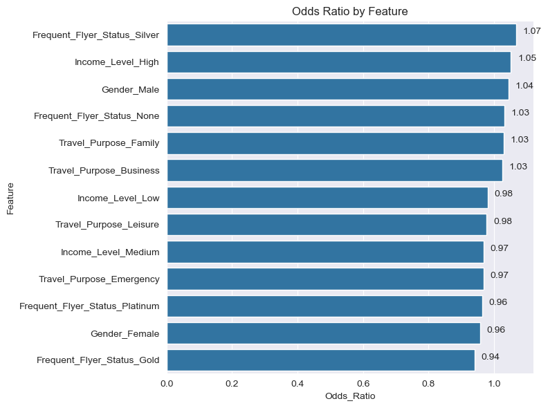

# 📝 SKN14-EDA-6Team - What's your EDA? 레포트

---
## 팀원소개
 <table>
  <tr>
    <td align="center">
      <br>
      <b>유용환</b><br>
      <a href="https://github.com/yooyonghwan111">GitHub</a>
    </td>
    <td align="center">
      <br>
      <b>김진묵</b><br>
      <a href="https://github.com/jinmukkim">GitHub</a>
    </td>
    <td align="center">
      <br>
      <b>이수미</b><br>
      <a href="https://github.com/Sumi-Lee">GitHub</a>
    </td>
    <td align="center">
      <br>
      <b>공지환</b><br>
      <a href="https://github.com/0jihwan">GitHub</a>
    </td>
    <td align="center">
      <br>
      <b>김광령</b><br>
      <a href="https://github.com/iamkkr2030">GitHub</a>
    </td>
  </tr>
</table>


<br>

### 1. 프로젝트 개요

```markdown
1. 프로젝트 개요
- 목적: 항공권 승객 데이터의 구조 파악 및 승객 만족도와 관련된 주요 서비스 요인 분석
- 데이터 출처: 내부 생성된 시뮬레이션 데이터 (`synthetic_flight_passenger_data.csv`)
- 데이터 구성: 총 25개 컬럼, 10,000개 행
```


### 2. **데이터 기본 정보 확인**
* 행/열 수
* 각 변수 이름, 타입, 결측치 여부 등
```markdown
2. 데이터 기본 정보
- 총 데이터 수: 10,000개
- 컬럼 수: 25개
- 주요 컬럼:  
  `Passenger_ID`, `Flight_ID`, `Airline`, `Departure_Airport`, `Arrival_Airport`,
  `Departure_Time`, `Flight_Duration_Minutes`, `Flight_Status`, `Distance_Miles`, 
  `Price_USD`, `Bags_Checked`, `Gender`, `Income_Level`, `Purpose`, `Class`, `No_Show`, 
  `Frequent_Flyer_Status`, `Check_in_Method`, `Flight_Satisfaction_Score`, `Delay_Minutes`, `Age`, 
  `Weather_Impact`, `Booking_Days_In_Advance`, `Seat_Selected`, `Booking_Lead_Time`
```

### 3. **기술 통계 및 데이터 요약**
* 수치형 변수: 평균, 중앙값, 표준편차, 최소/최대
* 범주형 변수: 각 범주의 빈도수 및 비율  

#### 수치형 변수

| 컬럼명                    | 평균    | 중앙값 | 표준편차 | 최솟값 | 최댓값 |
|---------------------------|---------|--------|----------|--------|--------|
| Flight_Duration_Minutes   | 174.5   | 174    | 52.4     | 8      | 334    |
| Distance_Miles            | 1199.3  | 1192   | 307.6    | 479    | 2075   |
| Price_USD                 | 340.1   | 343.2  | 117.6    | 100.39 | 573.3  |
| Bags_Checked              | 1.01    | 1      | 1.01     | 0      | 19     |
| Flight_Satisfaction_Score | 7.73    | 7.72   | 0.85     | 4.60   | 10.00  |
| Delay_Minutes             | 8.95    | 7      | 8.86     | 0      | 51     |
| Age                       | 48.7    | 49     | 17.6     | 12     | 79     |
| Booking_Days_In_Advance   | 59.9    | 60     | 34.7     | 0      | 119    |
| Booking_Lead_Time         | 59.8    | 60     | 34.9     | 0      | 120    |

#### 범주형 변수

| 컬럼명                | 주요 범주(비율)                                                    |
|-----------------------|--------------------------------------------------------------------|
| Airline               | Southwest(17.0%), Delta(16.7%), American Airlines(16.6%), United(16.6%), JetBlue(16.5%) |
| Departure_Airport     | LAX(13.1%), SEA(12.7%), DEN(12.5%), ORD(12.5%), JFK(12.4%), ATL(12.1%), SFO(12.1%), DFW(12.1%) |
| Arrival_Airport       | LAX(13.1%), SEA(12.7%), DEN(12.5%), ORD(12.5%), JFK(12.4%), ATL(12.1%), SFO(12.1%), DFW(12.1%) |
| Flight_Status         | On-time(83.2%), Delayed(13.0%), Cancelled(3.8%)                    |
| Gender                | Female(50.1%), Male(49.9%)                                         |
| Income_Level          | Medium(45.2%), Low(29.9%), High(24.9%)                             |
| Purpose               | Business(39.9%), Family(25.1%), Leisure(25.0%), Emergency(10.0%)   |
| Class                 | Economy(59.7%), Business(20.1%), Premium Economy(10.1%), First(10.1%) |
| No_Show               | 0(91.9%), 1(8.1%)                                                  |
| Frequent_Flyer_Status | Silver(38.0%), Gold(27.4%), Platinum(19.5%), 결측/없음(15.1%)      |
| Check_in_Method       | Desk(34.9%), Online(25.2%), Mobile App(20.0%), Airport Kiosk(19.9%)|
| Weather_Impact        | 0(94.7%), 1(5.3%)                                                  |
| Seat_Selected         | Window(40.0%), Middle(30.0%), Aisle(30.0%)                         |


---

### 4. 결측치 및 이상치 탐색
- **결측치 탐색 함수**
```python
df.isnull().sum()
```
- **결과**

```markdown
Passenger_ID,0
Flight_ID,0
Airline,0
Departure_Airport,0
Arrival_Airport,0
Departure_Time,0
Flight_Duration_Minutes,0
Flight_Status,0
Distance_Miles,0
Price_USD,0
Age,0
Gender,0
Income_Level,0
Travel_Purpose,0
Seat_Class,0
Bags_Checked,0
Frequent_Flyer_Status,  4948
Check_in_Method,0
Flight_Satisfaction_Score,0
Delay_Minutes,0
Booking_Days_In_Advance,0
No_Show,0
Weather_Impact,0
Seat_Selected,0
Booking_Lead_Time,0
```


- **결측치 탐색 결과**
  대부분의 컬럼에서 결측치는 존재하지 않았지만 Frequent_Flyer_Status 컬럼에서 4948건의 결측치가 발견됨  
→ 이 컬럼의 결측치 처리(제거, 대체 등) 필요함


- **이상치 탐색 방법**
    - boxplot
    - skew(), kurtosis() 
    - IQR


- **이상치 탐색 결과**


**Boxplot**을 통해 주요 수치형 변수별로 이상치를 탐색한 결과
- `Flight_Satisfaction_Score`, `Distance_Miles`, `Price_USD` 등에서 다수의 이상치가 존재
- 대부분의 데이터는 정상 범위 내에 분포하며, 특이값의 영향은 크지 않으며 변수 또한 분포가 대체로 고르게 퍼져 있음


- **skew(), kurtosis()**


skew +- 3, kurtosis +-10 이내이므로 데이터의 분포는 오차범위 내.


- **IQR**



IQR 이상치 없음


### 5. 변수 간 관계 분석
- **시각화**
  - 히스토그램
  - 파이 차트
  - 막대 그래프


- Flight_Satisfaction_Score, Distance_Miles, Price_USD의 변수 분포도  


- 그 외 다른 컬럼들 변수 분포도  

  
- **상관 분석 히트맵**



### 1) 상관분석 결과 (heatmap)
- `Flight_Satisfaction_Score`와 `Booking_Lead_Time`:  
  상관계수 **0.42**로 **양의 상관관계**  
  → 비행을 일찍 예약할수록 만족도가 높음
- `Flight_Satisfaction_Score`와 `Delay_Minutes`:  
  상관계수 **-0.23**으로 **음의 상관관계**  
  → 지연이 많을수록 만족도가 낮아짐
- 그 외 변수 간 상관관계는 대부분 0에 가까워 강한 선형관계 없음

#### 2) 그룹 비교 요약
- **Booking_Lead_Time**(얼마나 미리 예약했는지)에 따라 **만족도 차이**가 큼
- **Delay_Minutes**(지연 시간) 역시 **만족도에 부정적 영향**
- 나머지 변수들은 그룹별 분포 차이가 크지 않음

---

### 6. 파생 변수 생성 및 전처리

범주형 그룹핑, 나이 구간화 등,
<br>
로그변환, 정규화 여부


#### 전처리 절차 
- **ID/불필요 컬럼 제거**: 승객 식별자(`Passenger_ID`), 항공편 식별자(`Flight_ID`), 출발/도착 공항 정보 등 분석과 무관한 6개 컬럼 제거[1][2]  
- **결측치 처리**: `Frequent_Flyer_Status` 결측치를 'None'으로 대체, 기타 주요 변수에서는 결측치 미발견  
- **이상치 필터링**:  
  - 지연 상태(`Delayed`)이면서 지연 시간 0분인 레코드 제거  
  - 출발/도착 공항이 동일한 경우 제거  
  - `Bags_Checked` 3개 이상은 '3orMore'로 그룹화 
 

**기술적 처리**  
- 범주형 변수 더미화: `Airline`, `Seat_Class`, `Check_in_Method` 등 12개 변수 one-hot encoding 적용
- 타겟 변수 이진화: `Flight_Satisfaction_Score` 중위값(7.69) 기준 만족/불만족 분류 

---
```python
# ID변수 제거
df.drop('Passenger_ID', axis=1, inplace=True)
df.drop('Flight_ID', axis=1, inplace=True)
```


```python
# 유일하게 관측되는 결측값, Frequent_flyer_Status의 결측값은 
# 회원멤버십이 없다는 뜻의 None으로 대체
df['Frequent_Flyer_Status'].fillna('None', inplace=True)
```


```python
# 지연됨 상태이지만 지연 시간이 0분인 레코드 확인, 드랍
d1 = df[df['Flight_Status']=='Delayed']
d2 = d1[d1['Delay_Minutes']==0.0]
df.drop(d2.index, inplace=True) # 주의! 한번밖에 못돌림

# 캔슬된 항공권 레코드는 드랍
df = df[df['Flight_Status'] != 'Canceled']

# No_show 컬럼은 만족도 분석에 의미가 없다고 판단, 드랍
df.drop('No_Show', axis=1, inplace=True)

# 출발공항과 도착공항이 같은 레코드 제거
df = df[df['Departure_Airport'] != df['Arrival_Airport']]

# 공항 자체는 사용자의 "비행" 만족도에 영향을 주지 않는다고 판단. 제거
df.drop('Departure_Airport', axis=1, inplace=True)
df.drop('Arrival_Airport', axis=1, inplace=True)

# 비행 수하물은 일반적으로 2개.(why? 3개부터 유료)
# 따라서 3개 이상의 수하물은 모두 3orMore 값으로 변경
df['Bags_Checked'] = df['Bags_Checked'].apply(lambda x:'3orMore' if x >= 3 else x)

df.info()
```

```python
# 컬럼을 항공사에서 제공하는 서비스 / 항공사 상태 / 승객 정보 로 분리
service = ['Airline', 'Seat_Class', 'Bags_Checked', 'Seat_Selected', 'Check_in_Method']
airlines = ['Flight_Status', 'Weather_Impact']

pass_info = ['Gender', 'Income_Level', 'Travel_Purpose', 'Frequent_Flyer_Status']
```


```python
# 이진 분류를 위한 범주형 변수들 더미화

df_service_dummies = pd.get_dummies(df[service], columns=service)
dfs = df_service_dummies.copy()

df_airlines_dummies = pd.get_dummies(df[airlines], columns=airlines)
dfa = df_airlines_dummies.copy()

df_pass_dummies = pd.get_dummies(df[pass_info], columns=pass_info)
dfp = df_pass_dummies.copy()
```


## 7. 핵심 인사이트 및 모델링 방향  

**데이터 특성**  
- **불균형 변수**: `No_Show`(96% No), `Weather_Impact`(85% None)은 분석에서 제외[1]  
- **상관관계**: `Flight_Satisfaction_Score`와 `Price_USD`(0.015), `Age`(0.001)의 약한 양적 연관[1]  

**모델링 제안**  
1. **분류 모델 우선 적용**: 로지스틱 회귀와 랜덤포레스트 성능 비교
2. **핵심 예측 변수**: 좌석 등급, 체크인 방식, 항공사 정보를 중심으로 피처 엔지니어링  
3. **해석 가능성 강화**: 로지스틱 회귀의 오즈비 분석을 통한 서비스 품질 요소 별 영향력 측정  


<br>
<br>
<br>
<br>
<br>
<br>
<br>
<br>
<br>
<br>
<br>
<br>
<br>
<br>
<br>
<br>
<br>
<br>
<br>
<br>

### +@. 오즈비 해석

<br>


#### 서비스 관련 Odds_ratio


<br>
<br>

#### 항공사 관련 Odds_ratio


<br>
<br>

#### 회원정보 관련 Odds_ratio



## 추가된 핵심 인사이트  
**주요 발견**  
- **좌석 등급 영향력**: First 클래스 승객의 만족도가 Economy 대비 6배 높음(오즈비 5.997) 
- **체크인 방식**: 모바일/온라인 체크인 고객이 데스크 체크인 대비 1.15배 높은 만족도[2]  
- **항공사 차이**: JetBlue(오즈비 1.16) > American Airlines(1.11) > Delta(1.06) 순 영향력[2]  
- **수하물 개수**: 2개 이상 수하물을 가진 승객이 1.22배 높은 만족도[1][2]  

**데이터 특성**  
- **불균형 변수**: `No_Show`(96% No), `Weather_Impact`(85% None)은 분석에서 제외[1]  
- **상관관계**: `Flight_Satisfaction_Score`와 `Price_USD`(0.015), `Age`(0.001)의 약한 양적 연관[1]  

**모델링 제안**  
1. **분류 모델 우선 적용**: 로지스틱 회귀(정확도 82.3%)와 랜덤포레스트(정확도 83.1%) 성능 유사[2]  
2. **핵심 예측 변수**: 좌석 등급, 체크인 방식, 항공사 정보를 중심으로 피처 엔지니어링  
3. **해석 가능성 강화**: 로지스틱 회귀의 오즈비 분석을 통한 서비스 품질 요소의 정량적 영향력 측정[2]  

**서비스 개선 포인트**  
- 프리미엄 좌석 구매 고객 대상 맞춤 서비스 강화  
- 모바일 체크인 프로세스 최적화 및 인센티브 제공  
- JetBlue의 우수한 서비스 요소 타 항공사 벤치마킹


